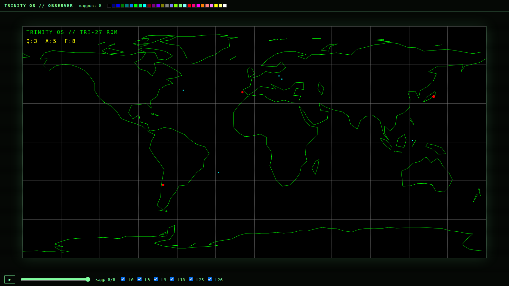

# TrinityOS — M0/M1: устройства Ring 0.5 и первый ROM

t27-native ОС из `research/t27-native-os-analysis.md`: контракты четырёх
MMIO-устройств для ядра TRI-27, их референс-эмуляция, обсервер Workbench —
и первый настоящий ROM: карта мира, нарисованная машинным кодом TRI-27.



Кадр выше исполнен **настоящим TRI-27** (`trinity/src/tri27/emu/executor.zig`
с патчем из `patch/`): ROM на 5194 инструкции (LDI/SHL/ADD/MUL/DIV/LD/ST)
рисует континенты и сетку через дисплей-лист DISP, запрашивает землетрясения
и борта у моста NET, читает счётчики HUD из регистров устройств. Проекция
lat/lon → экран считается арифметикой TRI-27 внутри ROM. У гостя нет доступа
ни к экрану, ни к сети мимо MMIO-окна.

## Состав

```
trinityos/
├── specs/os/                  # источник истины — .t27 спеки
│   ├── mmio_map.t27           # адресный план: 3^9 слов, окно MMIO — верхние 3^7
│   ├── dev_clk.t27            # CLK: unix-время, аптайм (snapshot-протокол LO/HI)
│   ├── dev_inp.t27            # INP: кольцо событий ввода (клавиши, указатель)
│   ├── dev_net.t27            # NET: мост данных (топики QUAKES/ADSB, записи 4 слова)
│   └── dev_disp.t27           # DISP: дисплей-лист (холст 1458×729, палитра 27 цветов)
├── emu/
│   ├── mmio.zig               # референс-эмуляция всех устройств; GOLDEN'ы спек = тесты
│   └── demo_worldmap.zig      # «гость»: карта мира через устройства → кадры JSON
├── observer/index.html        # окно Workbench: рендер кадров, слои, палитра, таймлайн
│   └── frames.js              # сгенерировано демо — обсервер работает сразу после clone
└── docs/observer.png          # снимок обсервера с кадром демо
```

## Запуск (нужен только Zig 0.15.x)

```bash
cd trinityos
zig test emu/mmio.zig           # 12 голден-тестов из спек — все зелёные
zig run emu/demo_worldmap.zig   # генерирует build/frames.json + observer/frames.js
# открыть observer/index.html в браузере (или перетащить туда build/frames.json)
```

## Карта MMIO (из specs/os/mmio_map.t27)

Память TRI-27 — 3^9 = 19683 слова. Окно устройств — 3^7 = 2187 слов с базой
**2·3^8 = 13122** (ADR-M1: досягаемость 15-битного immediate LD/ST),
каждому устройству блок 3^5 = 243 слова:

| Слова (от 13122) | Устройство | Суть |
|---|---|---|
| +0 | CLK | время: UNIX, аптайм, тики (RO, snapshot LO/HI) |
| +243 | INP | кольцо 24 событий по 2 слова, HEAD/TAIL |
| +486 | NET | doorbell/status/топик/параметры; записи по 4 слова в ОЗУ гостя |
| +729 | DISP регистры | COMMIT, HEAD/TAIL кольца, FRAME_ID, маска 27 слоёв |
| +972 | DISP кольцо | 1215 слов = 607 команд по 2 слова |

Дисплей — не пиксели, а **дисплей-лист**: CLEAR / POINT / MOVE_TO / LINE_TO /
GLYPH на виртуальном холсте 1458×729 (аспект 2:1 — равнопромежуточная карта мира
ложится точно). Палитра — 27 цветов: индекс = 3 трита (r,g,b).

## M1: интеграция с настоящим TRI-27 — сделано

В `patch/` лежит всё для репозитория `trinity` (здесь он read-only, поэтому
патч-файлом): `trinity-tri27-mmio.patch` — MMIO-диспетчер в ветках LD/ST
`executor.zig` (+ выравнивание ST по словам «как LD»), `trios_runner.zig` —
раннер (ассемблирует .tasm, исполняет с устройствами, пишет кадры в JSON;
рядом с ним нужен `trios_mmio.zig` = копия `emu/mmio.zig`). Прогон:

```bash
cd trinity && git apply .../patch/trinity-tri27-mmio.patch
cp .../emu/mmio.zig src/tri27/emu/trios_mmio.zig
cp .../patch/trios_runner.zig .../rom/worldmap.tasm src/tri27/emu/
cd src/tri27/emu && zig run trios_runner.zig -- worldmap.tasm frames.json
```

ROM генерируется из `rom/gen_worldmap_tasm.py` (береговая линия —
Natural Earth 110m, `rom/coastline.json`).

### Находки в ISA TRI-27 (кандидаты в спеку t27)

Первая же настоящая программа вскрыла четыре факта, невидимых юнит-тестам:

1. **LD и ST адресуют по-разному**: LD — словесный индекс (×4), ST — байтовый
   адрес, при этом комментарий в ST говорит «like LD». Патч выравнивает ST
   по словам; нужно решение на уровне спеки ISA.
2. **Immediate — 15 бит со знаком** (decoder: биты [31:17]), а не i16, и
   ассемблер **молча зажимает** значения вне ±16383. Из-за этого окно MMIO
   перенесено с «верха памяти» на **2·3⁸ = 13122** (ADR-M1 в mmio_map.t27);
   вернётся наверх, когда ISA получит косвенную адресацию.
3. **SHL/SHR кодируют src1 4 битами** — регистры выше t15 молча подменяются
   на t(n-16). Кодоген держит сдвиги на младших регистрах.
4. **OR — тернарный логический (Клини), не побитовый**, при этом AND —
   побитовый. Сборка битовых полей делается через ADD непересекающихся полей.

Отдельно: у ISA нет **косвенной адресации** (LD/ST только с immediate),
поэтому ROM полностью развёрнут кодогенератором — циклы по данным появятся
вместе с новыми опкодами (кандидат: LDR/STR через регистр).

## M2: живые данные — сделано

Мост стал настоящим: `workbench/fetch_live.py` забирает **USGS** (землетрясения
M2.5+ за сутки), **OpenSky** (живые борта; движение по кадрам — дедрекон по
курсу и скорости) и **CelesTrak** (видимые спутники, пропагация SGP4) и
выкладывает записи в формате устройства (`live_records.txt` + `live_meta.json`);
у раннера появился live-бэкенд, отдающий их по шагу таймлапса из PARAM1.
Новые топики спеки — `ADSB_XY`/`SATS_XY` (ADR-M2: screen-space записи, пока в
ISA нет косвенной адресации).

ROM worldview v2 (~12.9K инструкций TRI-27): плотная береговая линия, реальные
квейки с проекцией арифметикой TRI-27, 84 борта и 60 спутников с трейлами и
орбитальными следами (персистентные слои DISP), счётчики из регистров устройств
и **UTC-часы, посчитанные самим TRI-27** из регистра CLK (+2 мин на кадр
таймлапса). Обсервер: фосфорное свечение точек и строка live-снимка.

Полный конвейер:

```bash
python3 workbench/fetch_live.py            # свежий снимок мира
python3 rom/gen_worldmap_tasm.py           # ROM под счётчики снимка
cd trinity/src/tri27/emu && zig run trios_runner.zig -- \
    worldmap.tasm frames.json live_records.txt $(jq .unix .../live_meta.json)
```

## Что дальше (M3)

1. Предложение расширения ISA: косвенная адресация + широкий immediate
   (снимет ADR-M1/ADR-M2 и развёрнутые циклы — данные вернутся «сырыми»).
2. WebSocket-транспорт кадров в обсервер (сейчас — файл frames.js) и
   непрерывный цикл мост→ROM→экран.
3. Ядро: кооперативный планировщик + загрузчик с проверкой seal.
4. AI-устройство: VSA-аномалии по слоям (уникальность ternary-платформы).

φ² + 1/φ² = 3 | TRINITY
